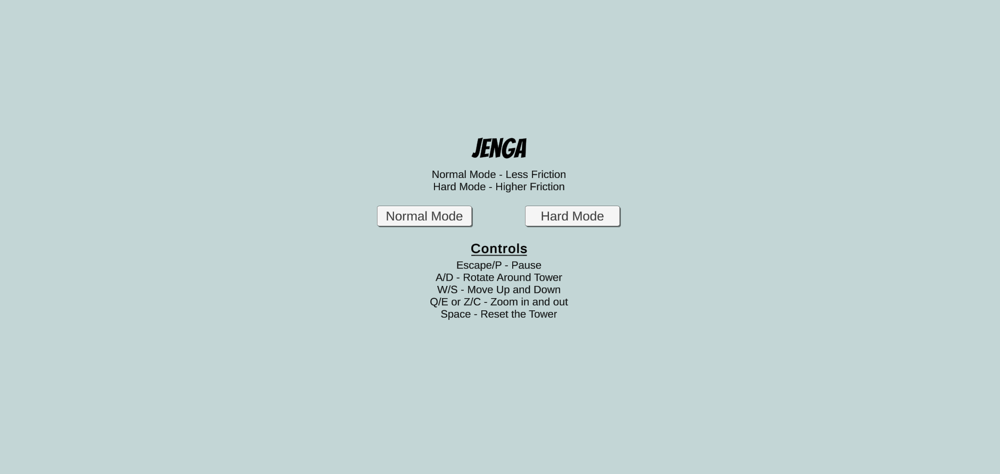
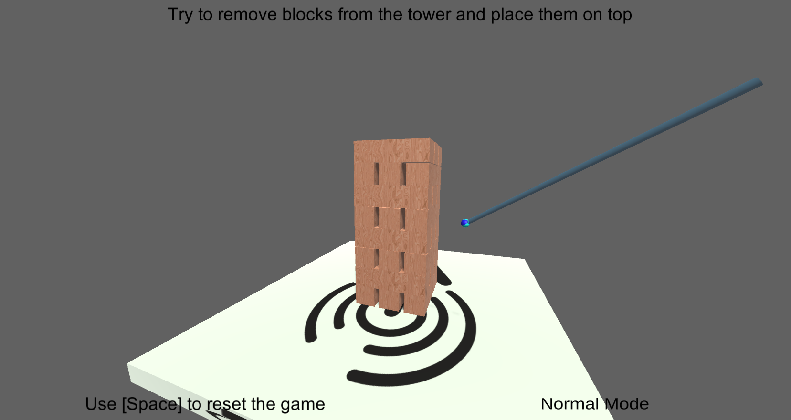
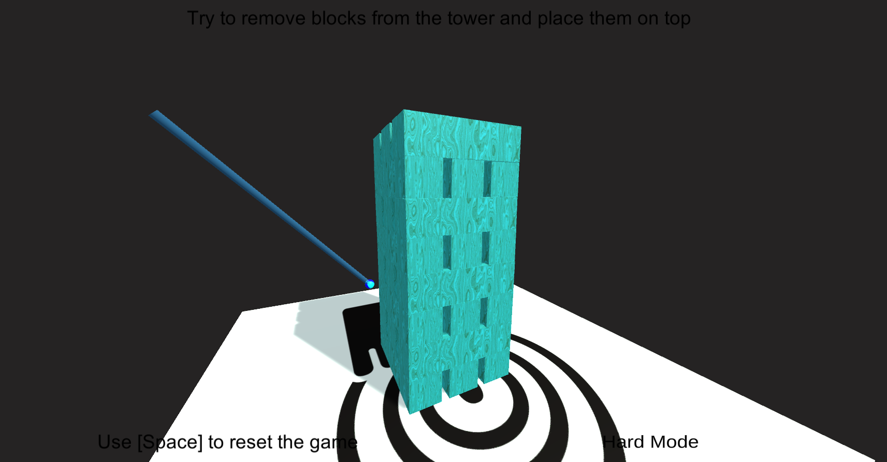
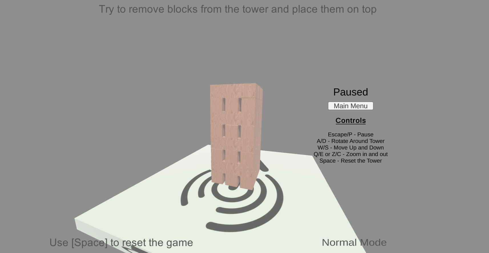
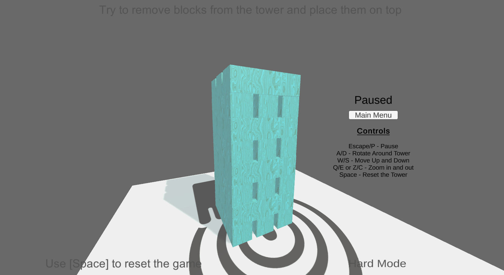

# Haptic Jenga

A virtual Jenga game made in Unity using a haptic stylus pen. The game features difficulty settings and haptic feedback, providing a realistic and engaging experience.

## Overview

This project was completed as a final project for ENSF 545 (Intro to Virtual Reality). It showcases the integration of haptic feedback with a Unity game to create an interactive virtual Jenga experience.

## Features

- **Haptic Feedback:** The game uses a haptic stylus pen as the controller, providing tactile feedback to enhance the gameplay experience.
- **Difficulty Settings:** Players can choose between normal and hard modes, each offering a different level of challenge.
- **Realistic Physics:** The game simulates realistic physics for a true-to-life Jenga experience.

## Technologies Used

- **Unity:** Game development platform for creating the virtual Jenga game.
- **Haptic Stylus Pen:** Used as the controller to provide haptic feedback during gameplay.

## Screenshots

### Main Menu


### Normal Mode


### Hard Mode


### Pause Menu



## Installation and Usage

To run the project locally:

1. Clone the repository:
   ```sh
   git clone https://github.com/ChaceN89/Haptic-Jenga.git
   ```
2. Open the project in Unity:
   - Open Unity Hub.
   - Click on `Add` and select the `Jenga Unity Game` folder.
3. Connect your haptic stylus pen.
4. Play the game:
   - Open the Unity Editor.
   - Click on `File -> Open Scene` and select the main scene.
   - Click on the `Play` button to start the game.

## Additional Information

- The game was developed as a part of ENSF 545 (Intro to Virtual Reality).
- The integration of haptic feedback enhances the realism and engagement of the virtual Jenga game.

## Contact

Project Link: [https://github.com/ChaceN89/Haptic-Jenga](https://github.com/ChaceN89/Haptic-Jenga)

Website: [https://chacenielson.com](https://chacenielson.com)
